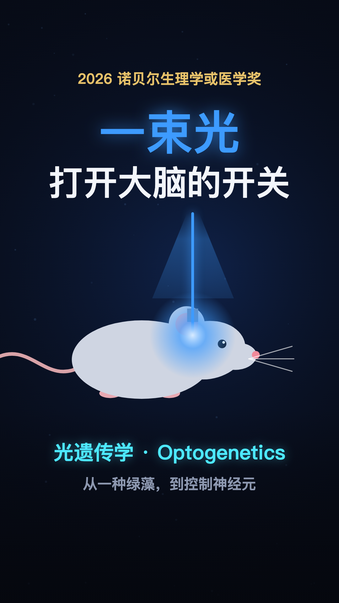

# 一束光，打开大脑的开关 · 2026 诺贝尔生理学或医学奖



竖屏 9:16 的科普短片，3 分 51 秒。讲 2026 年诺贝尔生理学或医学奖：Peter Hegemann、Georg Nagel、Karl Deisseroth，“因发现光门控离子通道和光遗传学”。故事从衣藻为什么会游向光讲起，一路讲到用光开关小鼠的神经元，再讲到它为什么改变了神经科学，以及第一批临床尝试。画面、字幕和音效全部用代码绘制，旁白用 Gemini 3.8 Flash TTS（aihubmix 中转，音色 Charon），片中没有使用照片或生成图片。

| 文件 | 说明 |
|---|---|
| [`nobel-2026-optogenetics_1080p30.mp4`](nobel-2026-optogenetics_1080p30.mp4) | 1080×1920 · 30fps，32 MB，-16 LUFS，字幕已烧录 |
| [`subtitles.srt`](subtitles.srt) | 外挂字幕，117 条，时间轴与画面内字幕一致 |
| [`cover.png`](cover.png) | 竖版封面 |

## 内容

- **开场**：蓝光照进小鼠大脑，熟睡的小鼠醒来；换一群神经元照，小鼠在安全的地方吓得僵住 → 光遗传学，2026 诺奖
- **三位得主**：黑格曼（1954，柏林洪堡大学）、纳格尔（1953，维尔茨堡大学）、戴瑟罗斯（1971，斯坦福 / HHMI）
- **难题**：大脑约 900 亿个神经元，各类细胞混杂在一起；只观察“哪里亮了、哪里坏了”，只能得到相关，证明不了因果；电极一刺就激活一片；克里克设想过用光来控制
- **衣藻**：衣藻靠眼点感光，游向光源；从见光到产生电信号只要 0.5 毫秒，人眼至少 10 毫秒；黑格曼猜测存在一种“自己感光、自己就是通道”的蛋白
- **蛙卵**：纳格尔把两个候选基因注入蛙卵，光照后通道打开、离子流入；2003 年在 PNAS 发表通道视紫红质-2（ChR2）
- **神经元**：精神科医生戴瑟罗斯向纳格尔要来基因，导入大鼠神经元；2005 年在 Nature Neuroscience 发表，蓝光一闪神经元就放电，精度达到毫秒级
- **小鼠**：2007 年用光纤控制运动皮层，让胡须动起来；同年唤醒熟睡的小鼠；2012 年与利根川进合作，重新激活恐惧记忆
- **意义**：只给特定类型的神经元装上开关，可开可关，第一次能直接验证因果；由此找到疼痛、口渴、进食、奖赏、社交等回路，也加深了对抑郁、焦虑、帕金森、阿尔茨海默病的理解
- **临床**：视网膜色素变性患者的视网膜导入光敏蛋白，配合发光眼镜，部分恢复视觉，能分辨并抓起桌上的物体
- **尾声**：一切起于一个问题——绿藻为什么会游向光

## 重新渲染

依赖：Node 20+、Python 3、ffmpeg、whisper（逐字对齐）、uv（混音时临时装 numpy）。

```bash
npm ci && npx playwright install chromium
python3 voice.py                   # 逐段配音 → 时间轴 build/timeline.js、旁白 audio/vo.wav、out/subtitles.srt
node render.mjs --stills 5,40      # 静帧预览 → build/stills/
node render.mjs                    # 6 路并行逐帧渲染（M 系列约 45 秒）→ build/video.mp4
uv run --with numpy python mix.py  # 程序化音效 + 配乐（旁白响起时避让）+ 响度归一 → out/nobel-2026-optogenetics.mp4
node render.mjs --cover            # 封面 → out/cover.png
```

- 旁白在 `script/script.json`：`text` 交给 TTS 朗读；`subs` 是字幕断行，拼起来必须和去掉标点后的 `text` 逐字一致；`gap` 是段前停顿；`style` 从 `styles` 里选风格描述。
- `audio/vo/` 是配音缓存（wav、whisper 词级时间、Qwen Omni 听验结果），缓存键是文本、风格和音色的哈希。只有改过的段落才会重新调用 TTS，需要 `AIHUBMIX_API_KEY`；听验需要 `OPENROUTER_API_KEY`，加 `--no-listen` 可跳过。只改 `subs` 不会触发重新合成。
- 画面在 `index.html`，只由时间 t 决定。动作用 `at('段id', '关键词')` 对齐到旁白念到该词的时刻。用静态服务器直接打开 `index.html`，就能边听旁白边预览。
- 配乐是 Mixkit「Focus on Yourself」（Eugenio Mininni，[Mixkit Stock Music Free License](https://mixkit.co/license/#musicFree)，可商用，免署名）。该授权不允许单独再分发曲目，所以文件不入库，`mix.py` 第一次运行时从 Mixkit 官方地址下载到 `audio/bgm/`。

## 事实与口径

主要依据诺奖官方的[新闻稿](https://www.nobelprize.org/prizes/medicine/2026/press-release/)和[科普背景](https://www.nobelprize.org/prizes/medicine/2026/popular-information/)（2026-10-05 发布）：

- 得主、出生年份、单位、获奖理由，以及 900 亿个神经元、0.5 毫秒对比至少 10 毫秒（“快二十多倍”）、ChR2 在蛙卵中的实验、2003 / 2005 / 2007 / 2012 这几个时间节点，均取自上面两份官方材料。
- 关键论文：Nagel 等，*Science* 2002（ChR1）；Nagel 等，*PNAS* 2003（ChR2）；Boyden、Zhang、Bamberg、Nagel、Deisseroth，*Nat. Neurosci.* 2005；Aravanis 等，*J. Neural Eng.* 2007。
- 2012 年的恐惧记忆实验，官方材料写作“Together with Susumu Tonegawa”，片中说的是“和利根川进合作”。
- 临床部分只用了官方科普背景里的表述：盲人患者部分恢复视觉，借助发光眼镜能分辨并抓起桌上的物体。片中没有给出具体年份和试验名称。
- “想关就关”一处的画面用黄光表示关闭。官方材料只说“还找到了能开关神经元、对不同波长起反应的其他蛋白”；用黄光关闭的蛋白（如 halorhodopsin）是行业常识，不是官方原文。
- 片中没有提到同样参与早期工作、但这次未获奖的研究者（如 Ed Boyden、Ernst Bamberg、Gero Miesenböck）。
